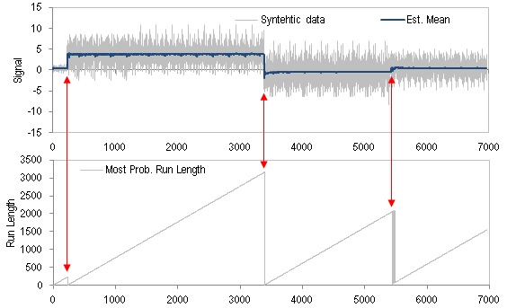

# Change-Point-Detection
Bayesian Online Change Point Detection for 1-dimensional time series, implemented in VBA.
Requires: [mChgPt.bas](mChgPt.bas), [modMath.bas](../../../Scientific-Toolkit/blob/master/Modules/modMath.bas)

The algorithm performs Bayesian changepoint detection in an online fashion on univariate time series. The core idea is to recursively calculate the posterior probability of "run lengths" as each new data point arrives. Run length is defined as the time since last changepoint occured.

One shortcoming of the method is that the probability density function of the signal and its conjugate prior needs to be specificed, which may not be obvious in some cases. Assumptions also need to be made on the decay rate of run lengths.

Simply import mChtPt.bas if you want to use this module. An Excel file [Chg_Pt_Demo.xlsm](Chg_Pt_Demo.xlsm) is included to show what it looks like.
It is tested on a synthetic signal with clear changepoints and a set of data with less obvious features. See the comments in the Excel file for a step by step guide on calling from this module.

Main reference is: "[Bayesian Online Changepoint Detection](https://arxiv.org/abs/0710.3742)", RP Adam, D MacKay 2007

The authors had a Matlab implementation [here](http://hips.seas.harvard.edu/content/bayesian-online-changepoint-detection), which is what my implementation is based on. But it does not benefit from the online capability of the algorithm, and requires a large (n_T x n_T) array in memory. It's re-written here so that data point can be fed in one by one. Default conjugate prior used is normal-inverse-gamma which is suitable for gaussian process with unknown mean and variance.
